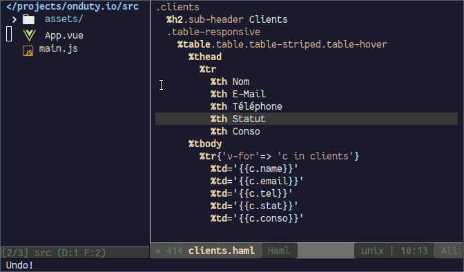
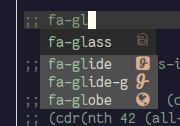

# company-fontawesome.el


A [company-mode](https://github.com/company-mode/company-mode/)
backend to autocomplete font awesome CSS class names **with icon
previz** !



## Setup

Copy `company-fontawesome.el` somewhere in your `load-path` then
execute the following:

```elisp
(require 'company-fontawesome)
(add-to-list 'company-backends 'company-fontawesome)
```

## FAQ

The wrong icon is displayed:



Disable the conflicting font (usually one of font-mfizz or octicons)
if you can't live with it until I find a way to force `company-mode`
to display the completion list using the Font Awesome face exclusively.

## Caveat Emptor

I finished the first iteration of this plug-in 90 minutes after writing my first
`(message "Hello, world!")` Emacs Lisp program. And it was 2am. Expect
rough edgez. :grin:

## TODO

- [ ] Cache candidates !
- [ ] Offer to insert the character instead of the class name
- [ ] Add completions for the modifier class names (e.g. fa-spin,
  fa-border, etc.)
